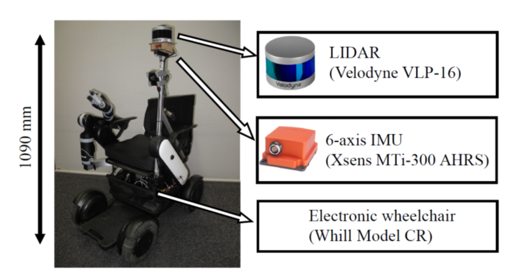

# 3D maps and sensor data in the city.
This City3DmapData repository provides the 3D maps and sensor data in an actual city of Japan. 
This data set also contains 3D LIDAR and IMU data and Pose graphs of the mobile robot used for 3D map construction.
You can also use these data sets to compare 3D map construction and LIDAR odometry in your work.

These data are used for evaluation in the article entitled 
"Semi-Automatic Town-Scale 3D Mapping using Building Information from Publicly Available Maps" in IEEE Access 2022 (URL).

- All dataset (33.4GB) : [https://data.airc.aist.go.jp/city-3Dmap-data/route1-6.zip](https://data.airc.aist.go.jp/city-3Dmap-data/route1-6.zip)
<!--
- Sample dataset (2.1 GB) route1 : [https://data.airc.aist.go.jp/city-3d-map/route1.zip](https://data.airc.aist.go.jp/city-3d-map/route1.zip)
-->
<p align="center"></p>


## Data acquistion overview

### 1. Platform

  **3D LIDAR** Velodyne VLP-16, 360 Horizontal Field of View (FOV) 15Hz.  
  **6-axis IMU** Xsens MTi-300 AHRS, 200Hz.  
  **Mobile base** Whill Model CR, max velocity 6km/h.  
  The positional relationship between the sensors is defined by static tf launch in scripts.  

<p align="left"></p>

### 2. Route

<div align=left>


| Route | Distance [km] | Time |
| :---: | :---: | :---: |
| 1 | 0.99 | 11 min 53 sec |
| 2 | 1.13 | 19 min 02 sec |
| 3 | 2.54 | 29 min 04 sec |
| 4 | 2.87 | 33 min 19 sec |
| 5 | 3.03 | 39 min 26 sec |
| 6 | 3.80 | 47 min 52 sec |
| Total | 14.36 | 3 hour 0 min 36 sec |

</div>


## Details of the data

### Data structure
  The dataset is stored in a separate directory for each route written in the paper.
  These sensor data were collected in Daiba, Koto-Ku, Tokyo, Japan.  
  The mobile robot was operated manually for moving along each route.
  ```
  data
  └───route1
  │   - sensor_data.bag 
  │   - 3Dmap.pcd
  │   - reference_posegraph.tum 
  │   - estimated_posegraph.tum
  └───route2
  │     ・
  │     ・
  │     ・
  └───route6
  ```

### 1. sensor data
  The sensor data is recorded in rosbag format.  
  Topics:   
  - 3D LIDAR: `/velodyne_points_world_filtered` \[[sensor_msgs/PointCloud2](http://docs.ros.org/en/noetic/api/sensor_msgs/html/msg/PointCloud2.html)\] 
  - 6-axis IMU: `/imu/raw` \[[sensor_msgs/Imu](http://docs.ros.org/en/noetic/api/sensor_msgs/html/msg/Imu.html)\]

### 2. 3Dmap
  The 3D map data is saved as Point Cloud Data ([PCD](https://pcl.readthedocs.io/projects/tutorials/en/latest/pcd_file_format.html)) file format.  
  The 3D maps are generated by projecting the LIDAR data based on the estimated_posegraph.

### 3. posegraph
  Format `tum` - TUM RGB-D dataset trajectory format  
  Every row has eight entries containing timestamp (in seconds), position and orientation (as quaternion), with each value separated by a space:  
  ~~~
  timestamp x y z q_x q_y q_z q_w
  ~~~
  More infos: [https://vision.in.tum.de/data/datasets/rgbd-dataset/file_formats](https://vision.in.tum.de/data/datasets/rgbd-dataset/file_formats)
  - reference_posegraph  
        The reference_posegraph were generated by setting anchor poses manually every 500 frames on the basis of the mobile mapping system\'s (MMS) 3D maps.  
  - estimated_posegraph  
        The estimated_posegraph were generated by the proposed mapping framework in the paper.


## How to visualize the data  
### Requirements  
  We used a robot operating system (ROS), point cloud library (PCL) and evo scripts for visualization data and tested by the following version.
  - [ROS melodic](http://wiki.ros.org/melodic/Installation)  
  - [pcl 1.8.1](https://pointclouds.org/)
  - [evo](https://michaelgrupp.github.io/evo/)
      
### Sensor data  
  Start the ROS visualization
  ~~~
  scripts/visualize_sensordata.sh
  ~~~
  Play the rosbag in another terminal  
  ~~~
  rosbag play sensor_data.bag --clock
  ~~~

### 3D map  
  ~~~
  pcl_viewer 3Dmap.pcd  
  ~~~

### Pose graph  
  ~~~
  evo_traj tum --plot --plot_mode xy --ref reference_posegraph.tum estimated_posegraph.tum
  ~~~

## License
This dataset is allowed only for noncommercial usage. Please cite our paper if you use this dataset for your work. The specific terms for use are written in the LICENSE.md.
  ~~~
  @ARTICLE{XXX,
    author={Shun Niijima, Ryusuke Umeyama, Yoko Sasaki, Hiroshi Mizoguchi},
    journal={IEEE Access}, 
    title={Semi-Automatic Town-Scale 3D Mapping using Building Information from Publicly Available Maps}, 
    year={2022},
    volume={},
    number={},
    pages={},
    doi={}}
  ~~~
